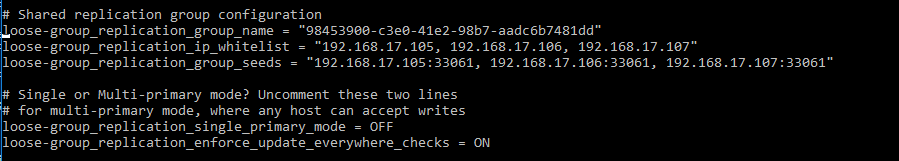

# BasisDataTerdistribusi

## Desain Infrastruktur


### Keterangan
Jumlah server yang digunakan ada 3 server database, 1 proxy server, dan 1 web server.

Server 1: OS yang digunakan yaitu bento/ubuntu-16.04.
          ip 192.168.17.105.
          RAM 512MB
          
Server 2: OS yang digunakan yaitu bento/ubuntu-16.04.
          ip 192.168.17.106.
          RAM 512MB
          
server 3: OS yang digunakan yaitu bento/ubuntu-16.04.
          ip 192.168.17.107.
          RAM 512MB        
          
Proxy Server: OS yang digunakan yaitu bento/ubuntu-16.04.
              ip 192.168.17.108.
              RAM 512MB          
              
Web Server: OS yang digunakan yaitu bento/ubuntu-16.04.
            ip 192.168.17.109.
            RAM 512MB            
            
          

### Set group Replication
1. install vagrant pada windows
2. masuk pada folder yang ingin digunakan dan lakukan init vagrant di folder tersebut untuk mendapatkan vagrant file.
3. kemudian edit vagrantfile menjadi seperti pada vagrantfile yang dilampirkan.
    vagrant file tersebut berisi konfigurasi untuk membuat 3 database server yang masing-masing memiliki memory 512MB dan os bento/ubuntu-16.04 serta sebuah proxy server dengan memory dan os yang sama. adapun pembagian IP seperti yang telah disebutkan pada desain.
4. kemudian kita buat sebuah file yang akan mengatur konfigurasi pada databaser server. yakni konfigurasi pada file ```deployMySQL1*.sh```. nantinya vagrantfile akan melakukan provision yang akan memanggil file tersebut untuk melakukan konfigurasi pada database.
5. buat juga sebuah file proxy seperti pada file ```deployProxy.sh``` yang nanti juga akan di provisi oleh vagrant file
6. atur masing-masing ```my.cnf``` dari database dan isikan seperti file ```my1*.cnf``` yang nanti akan kita copy menuju file /etc/mysql/my.cnf



jangan lupa untuk mematikan single primary mode jika ingin menggunakan group replication.

7. pada salah satu db kita masukkan file ```addition_to_sys.sql``` , ```cluster_bootstrap.sql``` , ```create_proxysql_user``` 
8. pada dua db lain masukkan file ```cluster_member.sql```

9. kemudian kita coba apakah group replication sudah berjalan.
